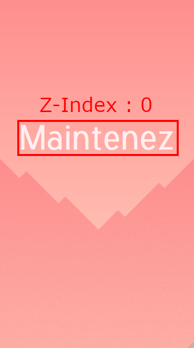
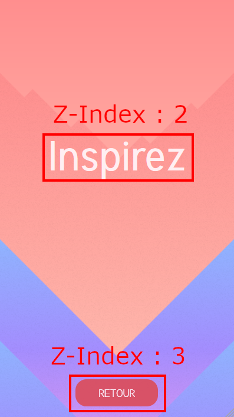

During the animation, in order to hide the text "Maintenez" behind everything I had to use z-index.

The z-index of the texts "Expirez" and "Bloquez" is also 2.
The z-index of the elements moving in background is 1.
